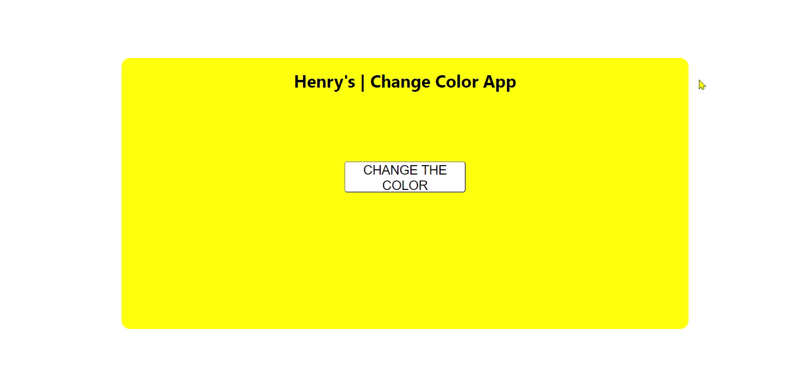

# **SOFTWARE DEVELOPMENT CON CHATGPT**

## **Snippets de Código**

### **INSTRUCCIONES**

Esta homework está dividida en dos partes. En cada parte pondrás en práctica tus habilidades para que ChatGPT desarrolle el código que necesitas.

**⚠️ Importante:** En cada una de las partes deberás ejecutar el comando **`npm install`**.

#### **🎯Parte 1**

Aquí te encontrarás con tres funciones regex. Deberás construir con ChatGPT el código regex para que se cumplan las condiciones que se piden.

#### **🎯Parte 2**

Aquí encontrarás dos archivos: **`RandomColor.jsx`** y **`RandomColor.css`**. Tu tarea será construir un componente utilizando un solo prompt con ChatGPT. Este componente debe funcionar y ser similar al que encontrarás en la siguiente imagen.

    

